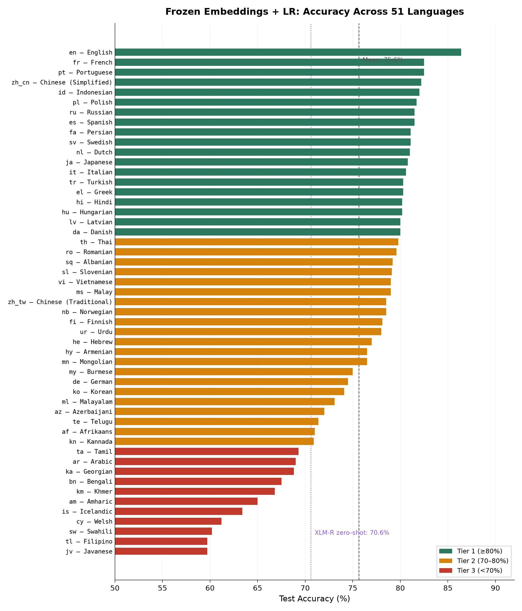
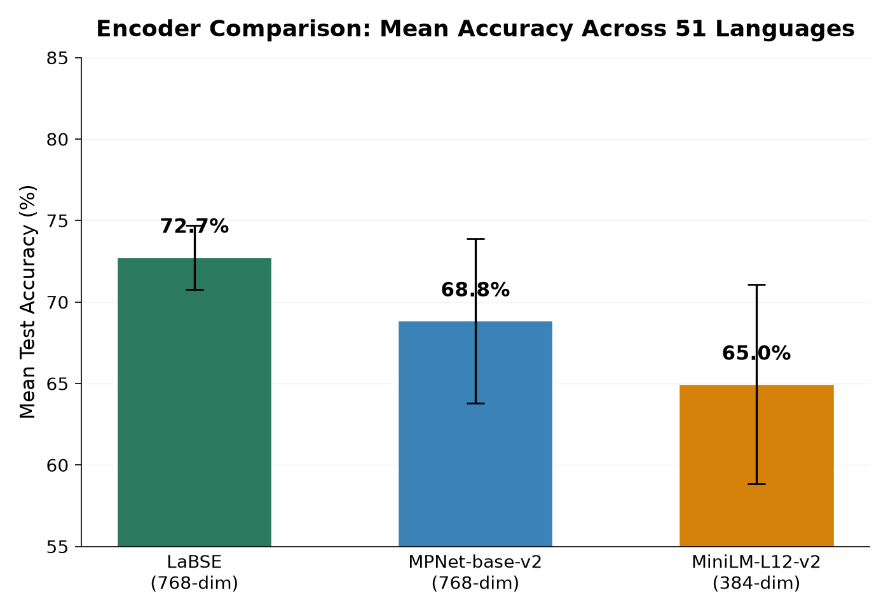
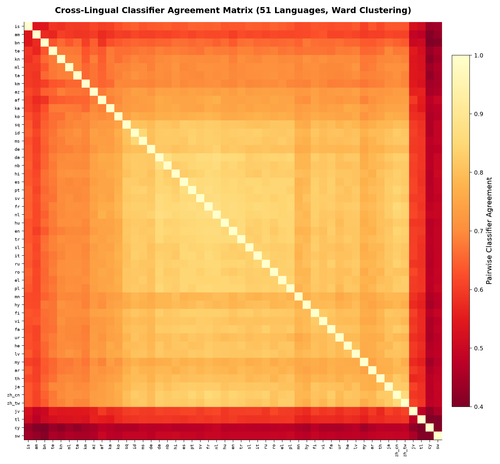

# Frozen Multilingual Embeddings as Universal Intent Classifier Foundations

*51 Languages, 100KB Per Task, No GPU Required*

Research companion to [Jeffy](https://github.com/nicobrenner/jeffy) — exploring how far frozen multilingual sentence embeddings + per-language logistic regression can go for intent classification across 51 languages.

**Target venue:** EMNLP 2027 · [Paper outline](paper/paper_outline.md)

## Key findings

### 75.6% mean accuracy across 51 languages at ~100KB per classifier

We train one logistic regression per language on top of a single frozen multilingual encoder (`paraphrase-multilingual-MiniLM-L12-v2`, 384-dim). All 51 classifiers train in 22 minutes on commodity CPU. Each weighs ~100KB — approximately **10,000× smaller** than fine-tuned XLM-R baselines (~1 GB per model).



19 languages exceed 80% accuracy. The mean (75.6%) beats XLM-R zero-shot transfer (~70.6%), though fine-tuned XLM-R (~88%) remains well ahead. The gap narrows with better encoders and hybrid features (see below).

### Encoder choice matters more than classifier complexity

We ablated three frozen encoders across all 51 languages with the same LR setup:



| Encoder | Dimensions | Mean accuracy |
|---------|-----------|---------------|
| paraphrase-multilingual-MiniLM-L12-v2 | 384 | 65.0% |
| paraphrase-multilingual-mpnet-base-v2 | 768 | 68.8% |
| LaBSE | 768 | 72.7% |

LaBSE improves +7.7 percentage points over MiniLM. In contrast, swapping LR for MLP or XGBoost yields minimal gains — the encoder is the bottleneck, not the classifier.

### Hybrid TF-IDF features close the gap for low-resource languages

Adding TF-IDF features alongside embeddings produces dramatic improvements for the lowest-scoring languages:

| Language | Embeddings only | + TF-IDF | Improvement |
|----------|----------------|----------|-------------|
| Swahili | 60.4% | 78.5% | **+18.1 pp** |
| English | 84.8% | 86.7% | +1.9 pp |
| German | 75.1% | — | (not tested) |

The benefit is largest where the encoder has weakest coverage — exactly where it's most needed.

### Cross-lingual agreement reveals encoder structure

We feed identical inputs to all 51 classifiers and measure pairwise agreement rates, creating a 51×51 matrix that probes how the shared embedding space encodes cross-lingual semantics.



Mean off-diagonal agreement: 72.1%. Agreement clusters by language family and correlates with encoder pretraining data. This is a novel evaluation methodology — classifier disagreement patterns reveal encoder biases invisible to standard per-language accuracy.

## Architecture

```
                    ┌──────────────────────────┐
  "set an alarm"    │  Frozen Multilingual      │     ┌─── LR (English)   → 86.4%
  "stell alarm ein" │  Sentence Encoder         │────►├─── LR (French)    → 82.5%
  "alarme réglée"   │  (384-dim, shared, 470MB) │     ├─── LR (German)    → 74.5%
                    └──────────────────────────┘     ├─── ...
                                                      └─── LR (Javanese)  → 59.7%
                                                           (~100KB each)
```

One encoder shared across all languages. One logistic regression per language. Total: 470 MB encoder + 51 × 100 KB classifiers ≈ 475 MB for all 51 languages.

## Data

All experiment results are in `data/`:

| File | Rows | Description |
|------|------|-------------|
| `training_results.csv` | 51 | Per-language accuracy, XLM-R baselines, training time, tier |
| `encoder_ablation.csv` | 153 | 3 encoders × 51 languages — accuracy, encode time, train time |
| `hybrid_features.csv` | 24 | 6 languages × 4 feature configs (emb, +tfidf, +surface, +both) |
| `classifier_ablation.csv` | 6 | LR vs MLP vs XGBoost on 6 representative languages |
| `agreement_matrix.csv` | 51×51 | Pairwise classifier agreement rates |
| `predictions.csv` | ~3K | Per-text predictions from all 51 classifiers |
| `distillation_poc.csv` | 4 | Proof-of-concept knowledge distillation (negative result) |

## Experiments

Reproducible scripts in `experiments/`:

```bash
pip install jeffy-classify

python experiments/cross_lingual_agreement.py   # 51×51 agreement matrix
python experiments/encoder_ablation.py           # 3 encoders × 51 languages
python experiments/hybrid_features.py            # TF-IDF + surface features
python experiments/classifier_ablation.py        # LR vs MLP vs XGBoost
python experiments/distillation_poc.py           # Knowledge distillation PoC
```

## Open questions

- **Can distillation close the gap?** Our PoC using XLM-R soft labels showed negative results — the LR architecture may be too constrained to benefit. More investigation needed.
- **How do few-shot learning curves compare to SetFit?** Not yet tested.
- **Inference benchmarking on edge devices** (Raspberry Pi, mobile) — planned.

## Structure

```
data/           Experiment CSVs and matrices
experiments/    Reproducible Python scripts
figures/        Generated charts (accuracy bars, encoder comparison, agreement heatmap)
paper/          Paper outline (EMNLP 2027) and blog outline
results/        Analysis summaries and notes
```

## Dataset

[Amazon MASSIVE](https://huggingface.co/datasets/mteb/amazon_massive_intent) — 1M+ utterances, 60 voice-command intents, 51 languages, CC BY 4.0.

## References

- FitzGerald et al., "MASSIVE: A 1M-Example Multilingual Natural Language Understanding Dataset with 51 Typologically-Diverse Languages" (ACL 2023)
- Conneau et al., "Unsupervised Cross-lingual Representation Learning at Scale" (ACL 2020) — XLM-R
- Reimers & Gurevych, "Sentence-BERT" (EMNLP 2019) — sentence-transformers
- Encoder: `sentence-transformers/paraphrase-multilingual-MiniLM-L12-v2` (384-dim, 118M params)

## License

CC BY 4.0 (same as the underlying MASSIVE dataset)
